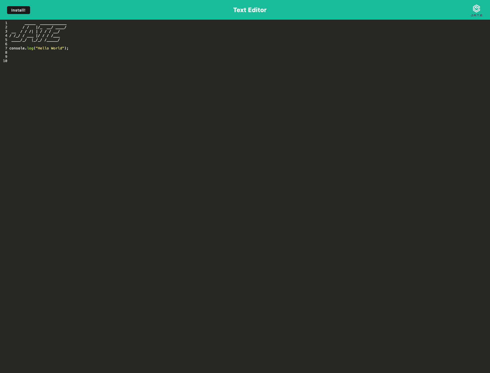

# Text Editor PWA

This project is a Progressive Web Application (PWA) that functions as a text editor. It allows users to create notes or code snippets with or without an internet connection, ensuring reliability and accessibility.

## Table of Contents

- [Features](#features)
- [Installation and Usage](#installation-and-usage)
- [Deployment](#deployment)
- [Technologies Used](#technologies-used)
- [Contributing](#contributing)
- [License](#license)
- [Contact](#contact)
- [Project Screenshot](#project-screenshot)

## Features

- **Offline Functionality**: The text editor works offline, allowing users to access and edit their content even without an internet connection.
- **IndexedDB Integration**: Utilizes IndexedDB for data storage, ensuring that content is saved and retrieved reliably.
- **Service Worker**: Implements a service worker using workbox for caching static assets, enabling faster loading and offline access.
- **Manifest File**: Includes a manifest.json file for a PWA experience, allowing users to install the application as an icon on their desktop.
- **Webpack Bundling**: Uses webpack for bundling JavaScript files, ensuring efficient and optimized code delivery.
- **Babel Support**: Utilizes Babel for using next-gen JavaScript features, ensuring compatibility with a wide range of browsers.

## Installation and Usage

To run the application locally:

1. Clone the GitHub repository: [repository_link_here]
2. Install dependencies using npm: `npm install`
3. Build the application using webpack: `npm run build`
4. Start the application: `npm run start`

## Deployment

The application is deployed using Heroku. To deploy the application, ensure you have the Heroku CLI installed and are logged in. Then, follow these steps:

1. **Create a new Heroku app:**

```bash
heroku create
```

2. **Add the Heroku Postgres add-on:**

```bash
heroku addons:create heroku-postgresql:hobby-dev
```

3. **Push the code to Heroku:**

```bash
git push heroku master
```

4. **Open the app in your browser:**

```bash
heroku open
```

## Technologies Used

- HTML/CSS/JavaScript
- IndexedDB
- Workbox
- Webpack
- Babel
- Heroku

## Contributing

Contributions are welcome! Please fork the repository and submit a pull request.

## License

This project is licensed under the Apache License 2.0 - see the [LICENSE](LICENSE) file for details.

## Contact

For inquiries or collaboration opportunities, please feel free to reach out.

- **Email:** [sjetnik@gmail.com](mailto:sjetnik@gmail.com)
- **GitHub Profile:** [Jetnik Syla](https://github.com/JetnikSyla)

## Deployment

This application is deployed on Heroku. You can access it [here](https://text-editor-heroku-5cfb742be3f2.herokuapp.com/).

## Project Screenshot


